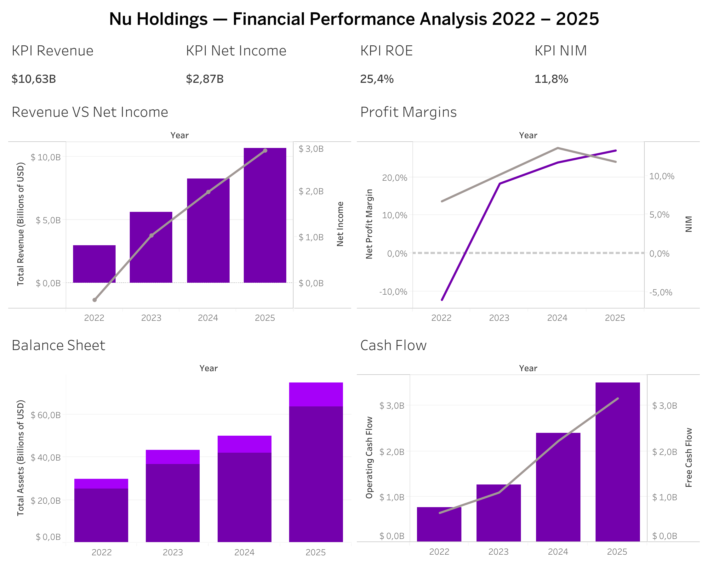

# Nu Holdings — Financial Performance Analysis 2022–2025

## English

### Overview
This project analyzes the financial performance of **Nu Holdings (NYSE: NU)** — Latin America's largest fintech company — using public financial statements from 2022 to 2025. The analysis covers the Income Statement, Balance Sheet, and Cash Flow Statement, with calculated financial KPIs and an executive dashboard built in Tableau Public.

### 🔗 Live Dashboard
👉 [View on Tableau Public](https://public.tableau.com/views/Nu-FinancialPerformance2022-2025/Dashboard1)

### 🎯 Objectives
- Extract and clean financial data from Yahoo Finance using Python
- Calculate key financial KPIs across profitability, growth, and financial health
- Build an executive-level dashboard to communicate insights visually

### 🛠️ Tools & Technologies
| Tool | Purpose |
|---|---|
| Python / Pandas | Data extraction, cleaning, KPI calculation |
| Yahoo Finance (yfinance) | Financial data source |
| Excel | Data validation and scale correction |
| Tableau Public | Dashboard and data visualization |

### 📊 KPIs Calculated

**Profitability**
- Net Profit Margin
- Operating Profit Margin
- Return on Assets (ROA)
- Return on Equity (ROE)
- Net Interest Margin (NIM)
- Cost-to-Income Ratio

**Growth**
- Revenue Growth YoY
- Net Income Growth YoY
- Free Cash Flow Growth YoY
- Total Assets Growth YoY

**Financial Health**
- Debt-to-Equity Ratio
- Debt-to-Assets Ratio
- Equity Multiplier
- FCF-to-Net Income Ratio

### 📈 Key Findings
- Revenue grew **258%** from 2022 to 2025 (from $2.97B to $10.63B)
- Nu Holdings turned profitable in 2023, achieving a **Net Profit Margin of 27%** by 2025
- **ROE reached 25.4%** in 2025 — significantly above the traditional banking industry average (~15%)
- **NIM peaked at 13.6%** in 2024, reflecting strong credit portfolio performance
- **Cost-to-Income Ratio dropped from 48% to 15%** — demonstrating exceptional operational efficiency at scale
- Free Cash Flow grew consistently, reaching **$3.16B** in 2025

### 📌 Data Notes
- Financial data sourced from Yahoo Finance via the `yfinance` Python library
- A scale inconsistency was identified and corrected in the 2023 figures (values were reported in thousands instead of units)
- All absolute values are expressed in **Billions of USD (B)**

---

## Español

### Descripción General
Este proyecto analiza el desempeño financiero de **Nu Holdings (NYSE: NU)** — la empresa fintech más grande de América Latina — utilizando estados financieros públicos del período 2022 a 2025. El análisis cubre el Estado de Resultados, el Balance General y el Flujo de Caja, con KPIs financieros calculados y un dashboard ejecutivo desarrollado en Tableau Public.

### 🔗 Dashboard en Vivo
👉 [Ver en Tableau Public](https://public.tableau.com/views/Nu-FinancialPerformance2022-2025/Dashboard1)

### 🎯 Objetivos
- Extraer y limpiar datos financieros de Yahoo Finance usando Python
- Calcular KPIs financieros clave de rentabilidad, crecimiento y solidez financiera
- Construir un dashboard ejecutivo para comunicar los hallazgos visualmente

### 🛠️ Herramientas y Tecnologías
| Herramienta | Uso |
|---|---|
| Python / Pandas | Extracción de datos, limpieza y cálculo de KPIs |
| Yahoo Finance (yfinance) | Fuente de datos financieros |
| Excel | Validación de datos y corrección de escala |
| Tableau Public | Dashboard y visualización de datos |

### 📊 KPIs Calculados

**Rentabilidad**
- Margen de Utilidad Neta
- Margen Operativo
- Retorno sobre Activos (ROA)
- Retorno sobre Patrimonio (ROE)
- Margen de Interés Neto (NIM)
- Ratio Costo-Ingreso

**Crecimiento**
- Crecimiento de Ingresos YoY
- Crecimiento de Utilidad Neta YoY
- Crecimiento de Flujo de Caja Libre YoY
- Crecimiento de Activos Totales YoY

**Solidez Financiera**
- Ratio Deuda-Patrimonio
- Ratio Deuda-Activos
- Multiplicador de Patrimonio
- Ratio FCF-Utilidad Neta

### 📈 Hallazgos Principales
- Los ingresos crecieron un **258%** de 2022 a 2025 (de $2.97B a $10.63B)
- Nu Holdings alcanzó rentabilidad en 2023, logrando un **Margen Neto del 27%** en 2025
- El **ROE llegó al 25.4%** en 2025 — muy por encima del promedio de la banca tradicional (~15%)
- El **NIM alcanzó su punto máximo de 13.6%** en 2024, reflejando un portafolio de crédito sólido
- El **Ratio Costo-Ingreso bajó de 48% a 15%** — evidenciando eficiencia operativa excepcional a escala
- El Flujo de Caja Libre creció consistentemente, alcanzando **$3.16B** en 2025

### 📌 Notas sobre los Datos
- Datos financieros obtenidos de Yahoo Finance mediante la librería `yfinance` de Python
- Se identificó y corrigió una inconsistencia de escala en las cifras de 2023 (valores reportados en miles en lugar de unidades)
- Todos los valores absolutos están expresados en **Miles de Millones de USD (B)**

---

*Project by [Ana Barahona](https://github.com/anabarahona9) | Portfolio: github.com/anabarahona9*
